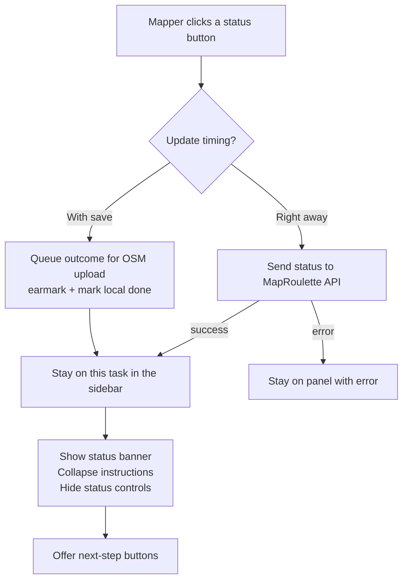
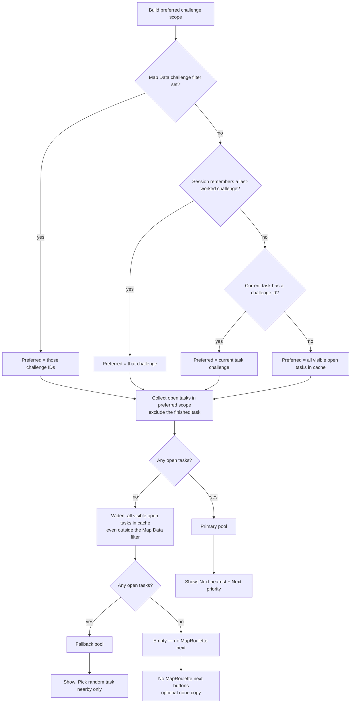

# MapRoulette sidebar: after you mark a task done

**Audience:** contributors and reviewers who need to understand what the MapRoulette task sidebar does **after** a status decision (Fixed, Already Fixed, Not an Issue, Can’t Complete).

**Intent:** The mapper should stay oriented on the task they just finished, see a clear outcome, then **choose** how to continue—nearest work, priority work, a random fallback when the preferred challenge is empty, or the linked OSM object—without the app auto-jumping away.

Implementation lives mainly in:

- [`modules/ui/maproulette_editor.ts`](../modules/ui/maproulette_editor.ts) — pin sidebar
- [`modules/ui/sections/maproulette_task.ts`](../modules/ui/sections/maproulette_task.ts) — entity inspector embed (same next-task rules; no “Show OSM” there)
- [`modules/util/maproulette_next_task.ts`](../modules/util/maproulette_next_task.ts) — challenge-scope pool + pickers
- [`modules/ui/maproulette_details.ts`](../modules/ui/maproulette_details.ts) — collapse instructions when done
- [`modules/util/maproulette_api_schema.ts`](../modules/util/maproulette_api_schema.ts) — Zod 4 schemas for `/tasks/box`, challenge, task detail, and session earmarks (parse at the service boundary)

---

## What the mapper is trying to do

1. Open a MapRoulette pin and understand the task.
2. Decide an outcome (Fixed / Already Fixed / Not an Issue / Can’t Complete).
3. Either queue that outcome for the next OSM upload (**With save**) or send it to MapRoulette immediately (**Right away**).
4. Stay on the done task long enough to pick a sensible **next** step—not get yanked to another pin or OSM feature unless they ask.

There is **no** “go to next nearby after submit” checkbox. Continuation is always an explicit button under the status banner.

---

## Flow after a status click

| Timing | What happens to MapRoulette | Sidebar after success |
| --- | --- | --- |
| **With save** | Outcome is earmarked; sent when the OSM changeset uploads | Queued banner + **Undo** + next-step buttons |
| **Right away** | Status (and optional comment) posted now | Resolved banner + next-step buttons |

In both success cases the panel **does not** auto-select a nearby task or a linked OSM entity.

---

## What the done panel looks like

Top to bottom in the pin sidebar:

1. **Challenge header** — pin icon + challenge name (DEU line). Finished pins use the solid status fill (e.g. Fixed green) with no priority wedge.
2. **Task meta** — challenge/task id and recognised OSM objects (always visible).
3. **Status banner** — which outcome was chosen (Fixed, Already Fixed, …). Queued adds **Undo**.
4. **Next-step buttons** — see tables and trees below.
5. **Details / Instructions** — iD disclosures (blue hide-toggle + arrow). Default **open** while the task is active; default **closed** after a status decision (session memory if the mapper reopens them).
6. **Hidden** while done: With save / Right away toggle, optional comment, tag-fix UI, status buttons.

The entity inspector MapRoulette section mirrors the banner + next-task buttons (without “Show OSM”, because the mapper is already on an OSM object).

---

## Choosing the next MapRoulette task

Mappers usually want to keep working the **same challenge** (or the challenges they filtered in Map Data). Only when that preferred set is empty do we offer a wider, random “something nearby in cache” escape hatch.

### Challenge scope (which tasks are candidates?)

**User-facing meaning**

| Situation | What we assume the mapper wants |
| --- | --- |
| Map Data filter lists challenge(s) | Stay inside that filter |
| No filter, but they just finished work in challenge X | Keep offering X (session “last worked”) |
| First task / no last worked | Use this task’s challenge |
| Preferred challenge has no other open pins in cache | Don’t pretend nearest/priority exist—offer **random** among other loaded challenges instead |
| Nothing else loaded | Say there are no other open tasks in view |

**Technical notes (why this is subtle)**

- Candidates are **only tasks already in the client cache** (from `/tasks/box` tiles). We do not call a MapRoulette “next task” or priority-queue API.
- “Open” means Created or Skipped (`isOpenTask`), and always **excludes** the task just finished.
- **Last-worked challenge** is in-memory for the session (`setLastWorkedChallengeId`), updated when the mapper completes or Accepts a task—not the same as the Map Data filter / URL `maproulette=` list.
- Fallback deliberately sets `ignoreChallengeFilter` so Random can leave an empty filtered challenge.

Code: `preferredChallengeIds` → `resolveCandidatePool` → `nextTaskActionsForPool` in [`maproulette_next_task.ts`](../modules/util/maproulette_next_task.ts).

---

## Next-step buttons

Which MapRoulette buttons appear depends on the pool mode above. **Show OSM** is independent: it appears whenever the finished task has linked OSM ids.

| Button | When shown | Mapper intent | How we pick the target |
| --- | --- | --- | --- |
| **Next nearest task** | Primary pool | Continue with the closest remaining work in preferred scope | Min spherical distance to **current** map center at click time |
| **Next priority task** | Primary pool | Continue with the most important remaining work in preferred scope | Lowest MapRoulette priority number (0 High → 2 Low); ties → nearest to **current** center |
| **Pick random task nearby** | Fallback pool only (preferred empty, other cache tasks exist) | “My challenge/view is empty—give me *something* else loaded” | Random among fallback tasks that intersect the **current** viewport if any; else random in the whole fallback pool |
| **Show way/123** (or node/relation) | Task has linked OSM elems | Jump to the mapped object for this task | Prefer way, then node, then relation; leave the MapRoulette sidebar for the entity inspector |

| Pool mode | Nearest | Priority | Random | Show OSM |
| --- | --- | --- | --- | --- |
| `primary` | yes | yes | **no** | if elems |
| `fallback` | no | no | yes | if elems |
| `empty` | no | no | no | if elems |

If every MapRoulette next button is absent and there is no linked OSM id, the panel shows the “no other open tasks in view” copy.

Click handlers **re-resolve** the pool and map center/viewport at click time so pan/zoom after finishing a task still affects nearest / priority / random. Which buttons are **visible** is decided when the done panel paints (or refreshes after Undo / Accept); pan alone does not add or remove the Random vs Nearest/Priority set until the panel re-renders.

---

## With save vs Right away (unchanged product split)

This post-done UX does **not** change when MapRoulette is updated—only how the sidebar behaves afterward.

| | With save | Right away |
| --- | --- | --- |
| Mapper intent | Finish OSM edits first; update MR with the upload | Record the MR outcome immediately |
| Comment field | Hidden (comment applies on upload path / earmark snapshot rules elsewhere) | Optional comment (max 1000 characters) |
| After success | Queued banner + Undo | Resolved banner |

---

## Related Map Data control

Map Data still has **Go to next nearby…** for jumping from the layer UI. That is separate from the post-done sidebar and still uses geographic nearest over the open-task cache (`goToNearbyMapRouletteTask`).

---

## Tests

Behavior of the challenge-scope tree and pickers is covered in [`test/spec/util/maproulette_next_task.ts`](../test/spec/util/maproulette_next_task.ts).
